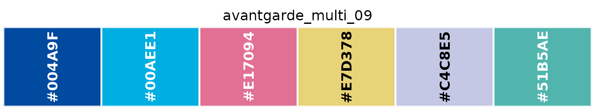
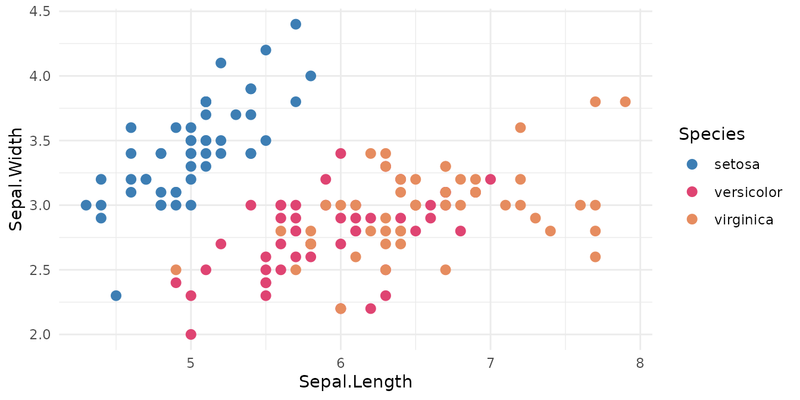
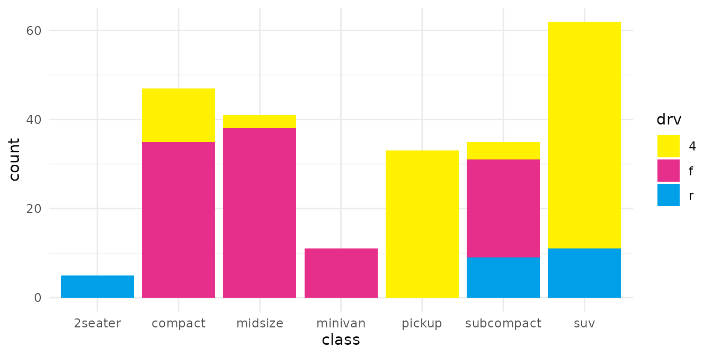
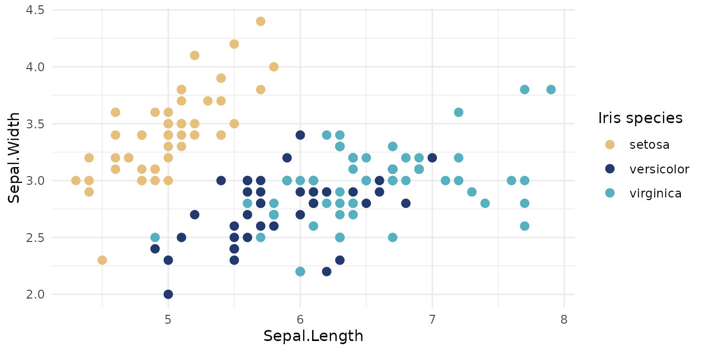

# Getting started with japanesecolors

## Palettes are objects

A palette is a character vector of hex colours, exported under its own
name:

``` r

library(japanesecolors)

kawaii_tri_07
#> [1] "#3D7EB4" "#DF4472" "#E68C5F"
```

So it works anywhere R takes colours:

``` r

barplot(c(5, 8, 3), col = kawaii_tri_07, border = NA, axes = FALSE)
```


To look at one:

``` r

show_palette(avantgarde_multi_09)
```



## Palette IDs

IDs have the form `<collection>_<type>_<nn>`:

| Part | Values |
|----|----|
| collection | `retro`, `minimalism`, `kawaii`, `avantgarde` |
| type | `bi` (bicolor), `tri` (tricolor), `four` (four-color), `multi` (multicolor) |
| number | zero-padded, contiguous within each collection and type |

These IDs are stable API. Descriptive names may be added later as
aliases; the numbered IDs will keep working.

## Browsing

[`palettes()`](https://paulgp.com/japanesecolors/reference/palettes.md)
returns the catalogue as a data frame:

``` r

head(palettes()[, c("id", "collection", "type", "n_colors", "status")])
#>            id collection    type n_colors      status
#> 1 retro_bi_01      retro bicolor        2 transcribed
#> 2 retro_bi_02      retro bicolor        2 transcribed
#> 3 retro_bi_03      retro bicolor        2 transcribed
#> 4 retro_bi_04      retro bicolor        2 transcribed
#> 5 retro_bi_05      retro bicolor        2 transcribed
#> 6 retro_bi_06      retro bicolor        2 transcribed
```

It filters by collection, matching type and number of colours:

``` r

palettes("minimalism", type = "bicolor")[, c("id", "n_colors")]
#>                  id n_colors
#> 1  minimalism_bi_01        2
#> 2  minimalism_bi_02        2
#> 3  minimalism_bi_03        2
#> 4  minimalism_bi_04        2
#> 5  minimalism_bi_05        2
#> 6  minimalism_bi_06        2
#> 7  minimalism_bi_07        2
#> 8  minimalism_bi_08        2
#> 9  minimalism_bi_09        2
#> 10 minimalism_bi_10        2
#> 11 minimalism_bi_11        2
#> 12 minimalism_bi_12        2

# anything wide enough for six groups
palette_names(n = 6)
#>  [1] "retro_multi_04"      "retro_multi_06"      "retro_multi_08"     
#>  [4] "retro_multi_09"      "minimalism_multi_01" "minimalism_multi_04"
#>  [7] "kawaii_multi_02"     "avantgarde_multi_01" "avantgarde_multi_02"
#> [10] "avantgarde_multi_05" "avantgarde_multi_07" "avantgarde_multi_09"
```

[`collections()`](https://paulgp.com/japanesecolors/reference/collections.md)
summarises the four collections:

``` r

collections()[, c("collection", "label", "n_palettes", "n_review")]
#>   collection       label n_palettes n_review
#> 1      retro       Retro         55        7
#> 2 minimalism  Minimalism         28        0
#> 3     kawaii      Kawaii         30        2
#> 4 avantgarde Avant Garde         36        4
```

## Choosing a palette programmatically

When the palette is decided at runtime, look it up by ID:

``` r

get_palette("retro_four_03")
#> [1] "#E72922" "#1E53A4" "#006637" "#CAB06B"

# the first n colours, or reversed
get_palette("retro_four_03", n = 2)
#> [1] "#E72922" "#1E53A4"
get_palette("retro_four_03", reverse = TRUE)
#> [1] "#CAB06B" "#006637" "#1E53A4" "#E72922"
```

Palettes are curated categorical sets and are never stretched. Asking
for more colours than a palette holds is an error, not a recycled or
interpolated colour:

``` r

get_palette("kawaii_tri_07", n = 5)
#> Error:
#> ! "kawaii_tri_07" has 3 colours; 5 requested. Pick a larger palette -- colours are not recycled or interpolated.
```

`palettes(n = 5)` will tell you which palettes are big enough.

## ggplot2

``` r

library(ggplot2)

ggplot(iris, aes(Sepal.Length, Sepal.Width, colour = Species)) +
  geom_point(size = 2.5) +
  scale_colour_japanesecolors("kawaii_tri_07") +
  theme_minimal()
```



``` r

ggplot(mpg, aes(class, fill = drv)) +
  geom_bar() +
  scale_fill_japanesecolors("avantgarde_tri_06") +
  theme_minimal()
```



All three take `reverse`, `na.value`, and anything else
`scale_*_manual()` accepts:

``` r

ggplot(iris, aes(Sepal.Length, Sepal.Width, colour = Species)) +
  geom_point(size = 2.5) +
  scale_colour_japanesecolors("retro_tri_02", reverse = TRUE, name = "Iris species") +
  theme_minimal()
```



Being plain vectors, they also work with
[`scale_colour_manual()`](https://ggplot2.tidyverse.org/reference/scale_manual.html),
which lets you pin colours to specific categories:

``` r

cols <- setNames(kawaii_tri_07, levels(iris$Species))

ggplot(iris, aes(Sepal.Length, Sepal.Width, colour = Species)) +
  geom_point(size = 2.5) +
  scale_colour_manual(values = cols) +
  theme_minimal()
```


For packages that expect a palette *function* of `n`, use
[`japanesecolors_pal()`](https://paulgp.com/japanesecolors/reference/japanesecolors_pal.md):

``` r

pal <- japanesecolors_pal("minimalism_multi_05")
pal(3)
#> [1] "#5BAE7F" "#B1C06B" "#EDDE7B"
```

## Transcription status

Colour values were read by hand from printed RGB labels. Readings that
were not reliably legible are recorded as provisional:

``` r

palettes_needing_review()[1:3, c("palette_id", "order", "hex")]
#>    palette_id order     hex
#> 1 retro_bi_13     1 #F4C03A
#> 2 retro_bi_14     1 #3071B9
#> 3 retro_bi_14     2 #E34950
```

They are exported like any other, and
[`palettes()`](https://paulgp.com/japanesecolors/reference/palettes.md)
includes them by default with `status == "review"`. For fully
transcribed values only:

``` r

nrow(palettes(include_review = FALSE))
#> [1] 136
```

See the [package README](https://paulgp.com/japanesecolors/) for where
the data came from.
